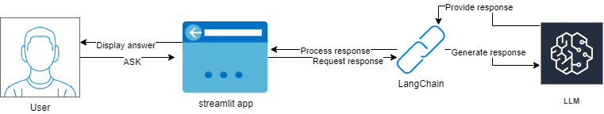
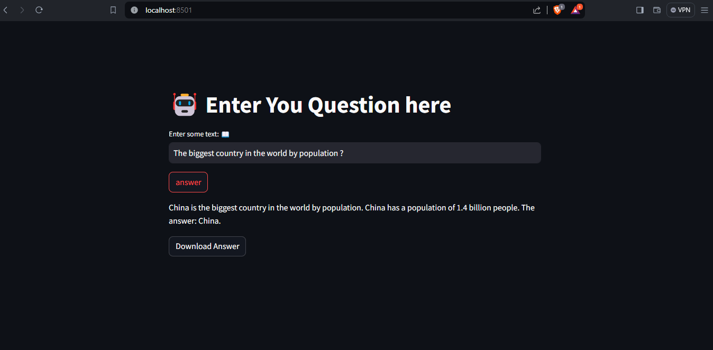
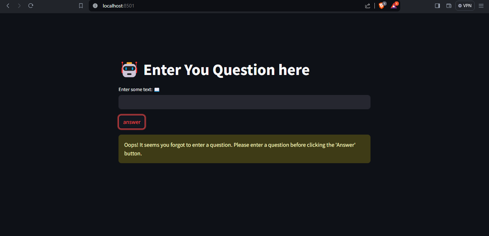

# Local ChatGPT

Local ChatGPT is a conversational language model application powered by Streamlit, LangChain, and Hugging Face. This application allows users to interact with a language model trained on various repositories from Hugging Face's model hub. Users can ask questions or provide prompts, and the model will generate responses based on the input.



## Features

- Interact with a conversational language model.
- Customize prompts and adjust model parameters.
- Download generated responses.
- Easy-to-use Streamlit interface.

## Installation

1. Clone the repository:

   ```
   git clone https://github.com/MrAzyz/AICHAT.git
   ```
3. Navigate to the project directory:
   ```
   cd AICHAT
   ```
4. Install dependencies:
   ```
   pip install -r requirements.txt
   ```
5. Run the Streamlit app:
   ```
   streamlit run app.py
   ```

Model : https://huggingface.co/google/flan-t5-xxl

# SCREENSHOTS



